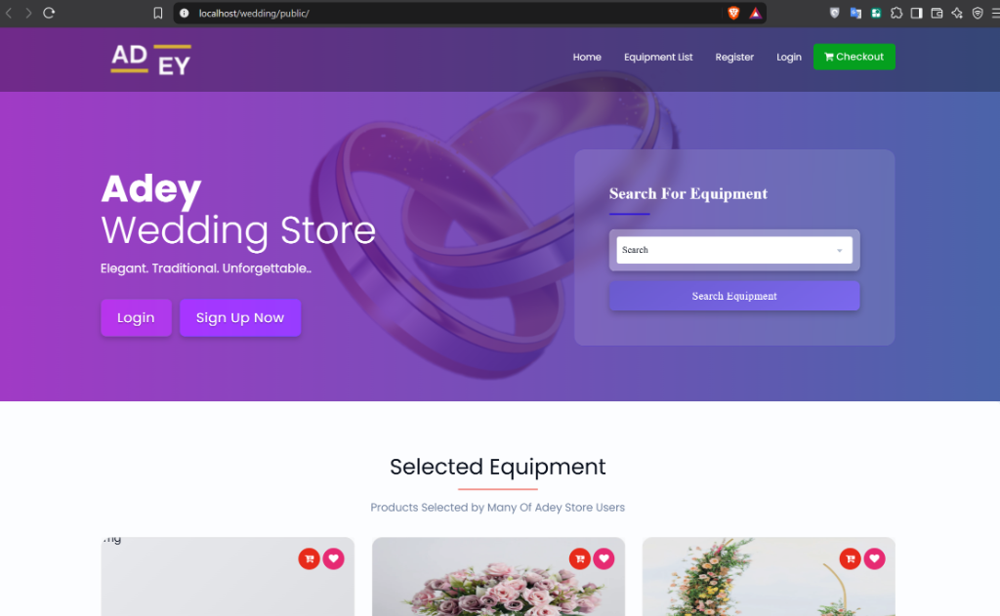
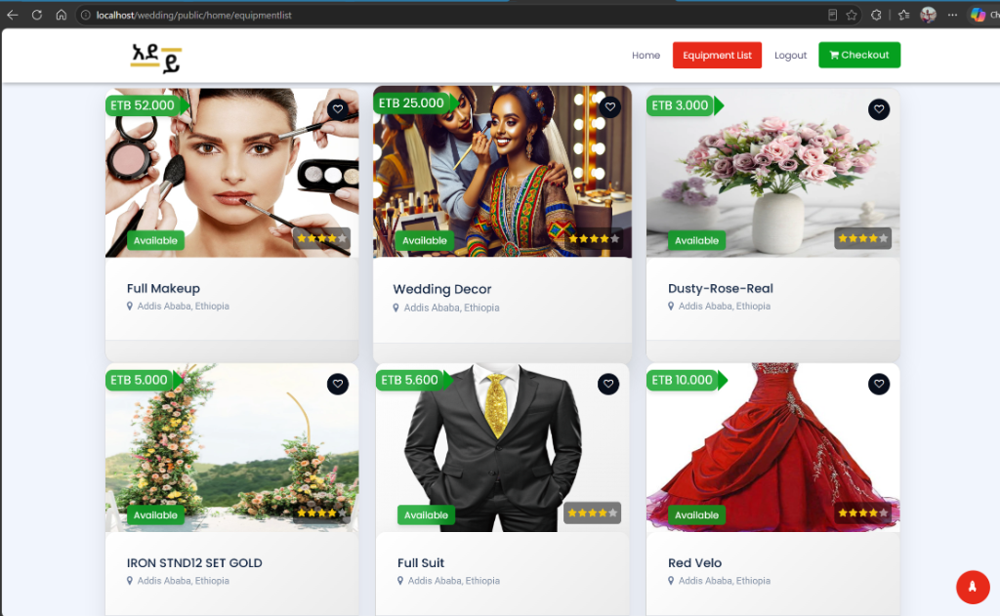
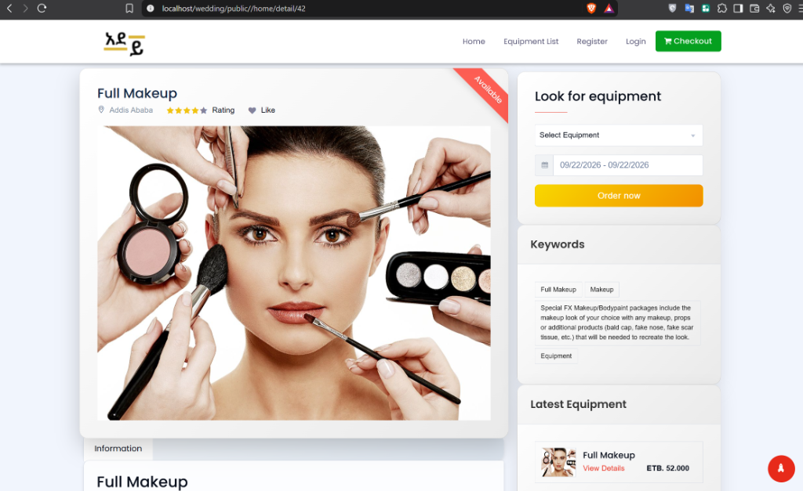
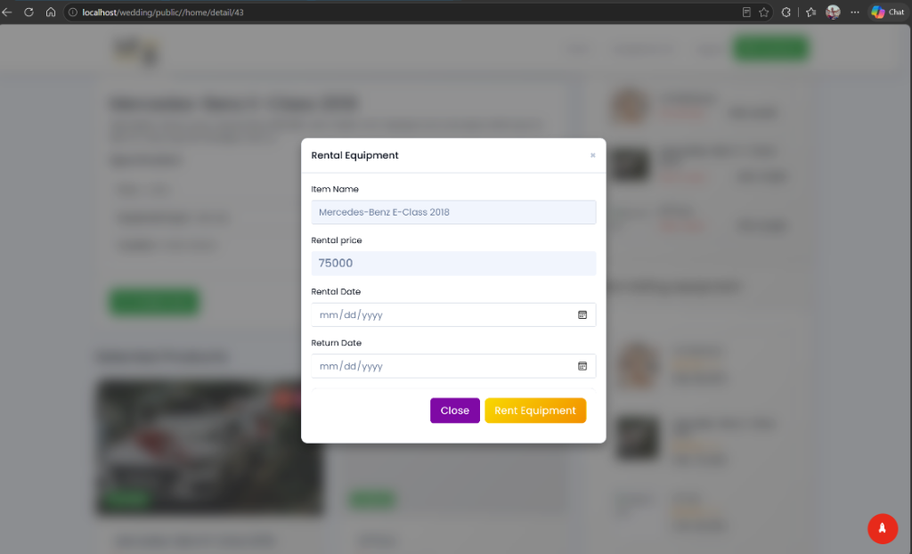
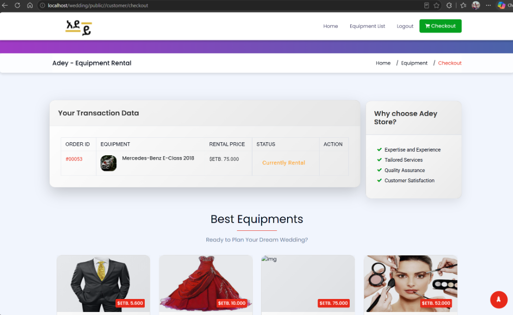
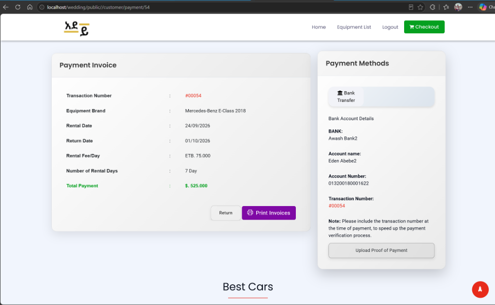
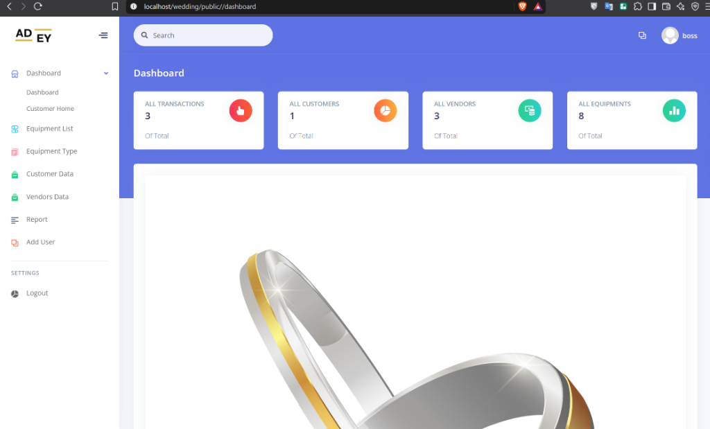
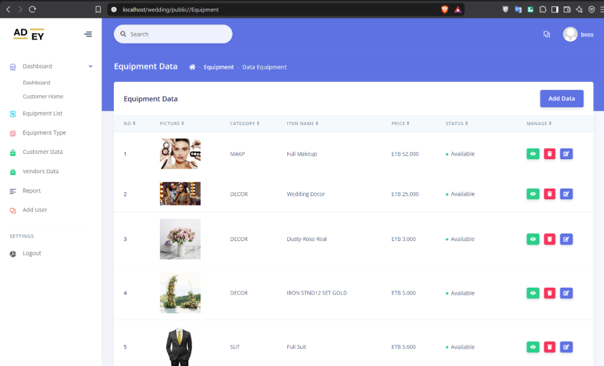

# Adey - Wedding Store & Equipment Rental Platform (አደይ)

Adey is an Ethiopian multi-vendor wedding equipment and services rental marketplace web application built with PHP and MySQL using a lightweight custom MVC architecture.

---

## 📸 Screenshots & UI Preview

### 1. Storefront & Catalog
| Home Page | Equipment Catalog |
|:---:|:---:|
|  |  |

### 2. Booking & Rental Flow
| Equipment Details | Date Booking Modal |
|:---:|:---:|
|  |  |

### 3. Orders & Bank Transfer Invoice
| Customer Checkout | Payment Invoice with Bank Transfer |
|:---:|:---:|
|  |  |

### 4. Admin & Vendor Management
| Argon Dashboard Overview | Equipment Management Data Table |
|:---:|:---:|
|  |  |

---

## Features

- **Multi-Role System**:
  - **Customers**: Browse equipment (attire, cars, makeup, decor), request rentals by date range, manage orders, and upload bank transfer receipts.
  - **Vendors**: Manage equipment listings, upload item photos, monitor rental transactions, verify customer payment slips, and generate rental reports.
  - **Admin**: Manage all users (customers and vendors), manage equipment categories, and oversee system operations.
- **Catalogue & Categories**:
  - Suits & Dresses
  - Vehicles & Luxury Wedding Cars (e.g. Mercedes-Benz)
  - Decorations & Floral Setups
  - Makeup Packages
  - Tables & Chairs
- **Manual / Bank Transfer Flow**:
  - Supports offline/bank deposits (Awash Bank, CBE, etc.) with transaction proof upload and vendor confirmation workflow.

## Tech Stack

- **Backend**: PHP (MVC structure, PDO database abstraction)
- **Database**: MySQL / MariaDB (`adeydb`)
- **Frontend**: Bootstrap 4, Argon Dashboard (Admin/Vendor), jQuery, Owl Carousel, Select2, FontAwesome

## Getting Started

### Prerequisites

- [XAMPP](https://www.apachefriends.org/), WampServer, or LAMP stack (PHP 7.4+ or 8.x and MySQL 5.7+)
- Apache `mod_rewrite` enabled

### Installation

1. **Clone the repository**:
   ```bash
   git clone https://github.com/Wesen15/Adey-Wedding-Store.git wedding
   ```
2. **Move to web server root**:
   Place the project folder inside your `htdocs` directory:
   ```text
   C:/xampp/htdocs/wedding/
   ```
3. **Import Database**:
   - Open PHPMyAdmin (`http://localhost/phpmyadmin`) or MySQL CLI.
   - Create a database named `adeydb`.
   - Import the SQL schema and seed data from `Database/adeydb.sql`.

4. **Configuration**:
   - Check `app/config/config.php` and verify your `BASEURL` and database credentials:
     ```php
     define("BASEURL", "http://localhost/wedding/public");
     define("DB_HOST", "localhost");
     define("DB_USER", "root");
     define("DB_PASS", "");
     define("DB_NAME", "adeydb");
     ```

5. **Run the Application**:
   - Start Apache and MySQL in your server control panel.
   - Navigate to `http://localhost/wedding` or `http://localhost/wedding/public` in your browser.

### Default Test Accounts
- **Admin**: `boss` / password: `admin123`
- **Vendor**: `eden` / password: `vendor123`
- **Customer**: `hermi` / password: `customer123`

## Project Structure

```text
wedding/
├── app/                 # Backend MVC (controllers, models, views, core)
├── Database/            # adeydb.sql database dump and schema
├── public/              # Document root (index.php, .htaccess, uploaded assets)
└── screenshots/         # UI showcase screenshots
```
